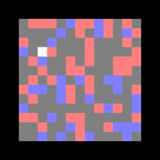
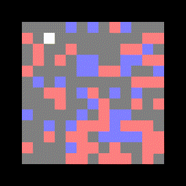
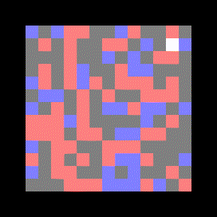
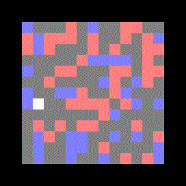

# Deep Reinforcement Learning - MVA 

Mini Project for the Deep Learning course of the MVA master (ENS Paris Saclay) taught by Vincent Lepetit.

A rat runs on an island and tries to eat as much as possible. The island is subdivided into $N\times N$ cells, in which there are cheese (+0.5) and poisonous cells (-1). The rat has a visibility of 2 cells (thus it can see $5^2$ cells). The rat is given a time $T$ to accumulate as much food as possible. It can perform 4 actions: going up, down, left, right.
The goal is to code an agent to solve this task that will learn by trial and error.

### A random game

### Dummy Fully Connected Agent

### Dummy Convolutional Agent

### Fine-tuned Convolutional Agent with incentives for exploration

